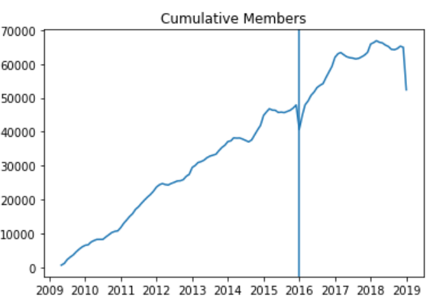

# IC_BA_2020_BIA_A3

Q2:  What happened when the price was increased?
                                                     
How affected: - membership type
              - social class  
              - gender  
              - age 

### Qian:
#### What happened when the price was increased, revenue plot over time
#### Any trend in visitation during last months before gym : 
* peak times  
* freq per month
#### What I have found so far

* Chart 1: if I draw the number of membership versus time, we could find that the number of membership has been increasing constantly over time, although it dropped in 2016 while the price increased

* Chart 2: if I draw the number of membership seperately according to the type of membership, we could find the the drop of customers was primarily caused by drop of standard customer. The reason could be that most members have standard memberships, as what is found by Jiaqi

* Chart 3(Above) and Chart 4(Below): the membership of most customers only last less than 3 months, but the group who contribute the most to the revenue are those whose memberships last between 1 year and 3 months 

###  Mary: 
#### Churn rate over time DONE 
Based on Jiaqi's analysis I plotted the churn rate over time and the insights are those that Jiaqi mentions on  __Graph 3__
#### Membership over time DONE
The membership growth over time seems to move around an average between 2012 and 2015, while there is a steep increase in late 2015 (maybe because of the reduction of total members??) and then it decreases again quickly. It seems that there is no longterm impact in the membership growth
#### I explore now:
* Membership change per club  // clubs - members number over time
* Seasonality

### Arianna:
#### Hey guys i'm still learning my way to use pandas but here is some finding i found use other software. It shall be a good benchmark for double check and ideas. 
#### Currently i'm doing most analysis in excel & powerbi and moved/will move to jupyter if find any useful insights.

#### Findings - benchmark and won't include in jupyter
#### Average duration of membership is around 4.5 month for standard, and 2 month for flexible.
#### There is no significant membership duration differnece between 
* Affluence (range 2.3-1.97 for flexible; 5-3.8 for standard)
* different clubs (range 2.5-2 for flexible;  5.3- 4.1 for standard)
* ages (seperated by age group- range 2.6-1.9 for flexible ; 5.7-4 for standard)
* Gender (2.3-2.2 for flexible; 4.8 - 4.5 for standard)
                                                               
#### Interesting insights - Will/has move to pandas by tomorrow:
* for people left membership- there is no change in AFFLUENCE over year
* for people still in memebership - there is trend by affluence, gender membership status amond different years. However there is no change if we filter the data by memebership status >12 month.
*  younger people are more willing to join club in recent year. we can target promotion here 
* In general we see a reduction in number of memebers that left gym in 2016 compare wil 2015, and increase in numbers of members that join gym in 2016 compare with 2015. This might due to new gym opening - further investigation required
                                                       
                                                                                                 
### Jiaqi:
* Uploaded jupyter file of my code:
* The first two graphs is an initial overview of OC&Gym's customer segment(maybe can put in intro of presentation?)
* __Graph 1__: Affluence segment and membership type; B is the affluence group with highest members; Most members have Standard memberships(True across all affluence classes)
* __Graph 2__: Gender and age: Calculated age of each member and split into age-groups, most customers are from the age-group 30-39; there is relatively higher number of male members across all age groups

#### Graph 3 and 4 may be relevant to __Q2:What happened when the price was increased?__
* __Graph 3__: cancellations percentages(Monthly) : There is a sharp increase in percentage of cancellations just before the price increase in 01/01/2016, this may be due to OC&Gym's policy that  for standard customers, they are given the option of leaving before the price rise. However this increase in cancellation is not long-term. The percentage cancellations overtime seem to have seasonality trends
* __Graph 4__: New membership percentages(monthly) : There is a small decrease in percentage of new membership just after the price increase, however the decrease is not significant, thus the price increase seem to have small effect on percentage of monthly new memberships.
* I joined the data from both visitation datasets with the subscriptions dataset together into one dataframe

### Jiaqi & Jiaxuan：
#### Hi! We have uploaded a pdf file in the list.

This pdf file includes：
* Basic industrial backgrounds for the fitness industry and the problems that many gyms have been facing now. 
* Common and maningful KPIs for this industry that can be used in our analysis. We can choose some of them based on our data results.
* Potential OKRs that may be used to measure our analysis. This is mentioned in our project requirements. We think this part can be combined with the benchmarks from other competitors, using the competitors' data to set up our own OKRs. Here we include two feasible companies and the first one seems to be a better choice since it has more information with the data in their reports. 

If you guys have any thought for deeper researches or wants to include extra perspectives, we can focus on specific parts after considering our analysis results.
